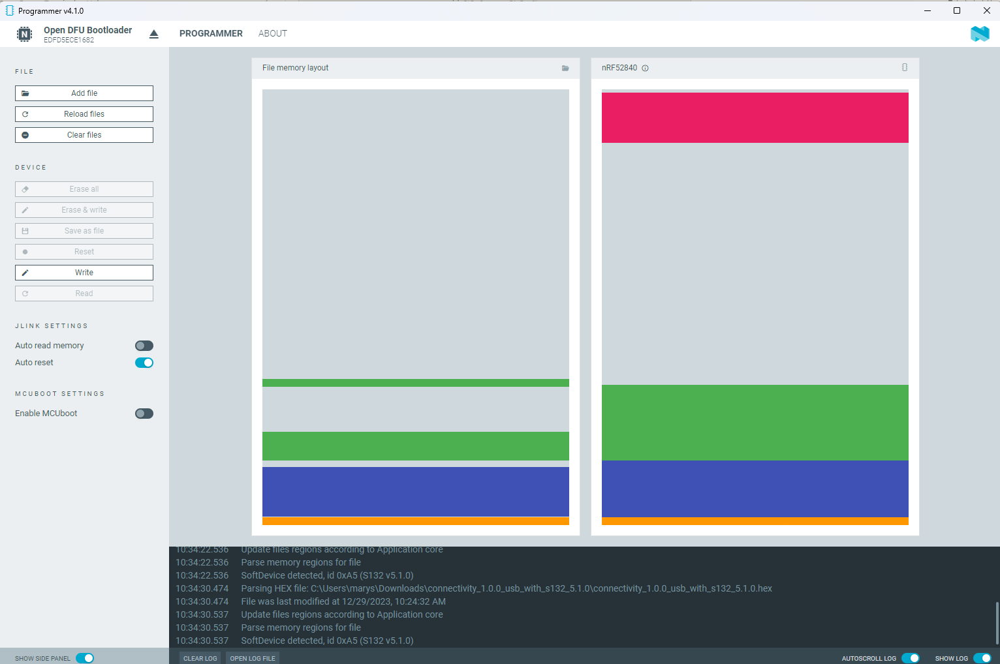
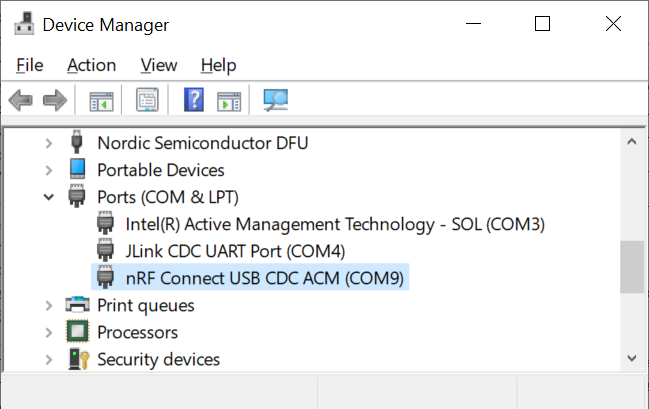
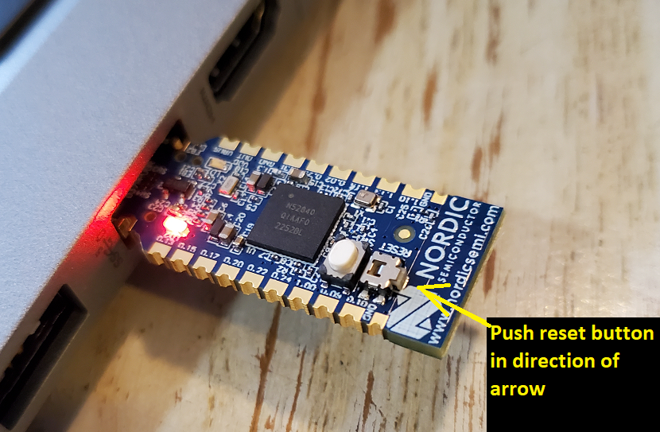

# Duke Project Example - Connect IQ App
This guide will assist you in getting started with development of a Connect IQ (CIQ) application that uses Bluetooth to 
communication with an external accessory. In the example, bi-directional communication is established between 
a [Garmin vívoactive 5 smartwatch](https://www.garmin.com/en-US/p/1057989/pn/010-02862-10) and an accessory 
([nRF52 DK](https://www.nordicsemi.com/Products/Development-hardware/nRF52-DK)). The guide also explains how to setup 
your CIQ development environment and enable the Bluetooth functionality within the CIQ device simulator.

> [!WARNING]
> Be sure to complete the [nRF_CustomBleProfile guide](https://github.com/4djelliot/nRF_CustomBleProfile) prior to cloning
this repo, since we recommend cloning this repo into a new _DukeSampleApp_ folder in your Connect IQ SDK's _samples_ folder.

# Step 1: Gather, Install, and Setup System Requirements
## Hardware
In addition to the [hardware list](https://github.com/4djelliot/nRF_CustomBleProfile?tab=readme-ov-file#hardware) in the 
nRF_CustomBleProfile guide you will need: 
* [Garmin vívoactive 5 smartwatch](https://www.garmin.com/en-US/p/1057989/pn/010-02862-10) or another compatible smartwatch.
* [Garmin USB-A Charging/Data Cable](https://www.garmin.com/en-US/p/696132/pn/010-12983-00)
* [nRF52840 USB Dongle](https://www.nordicsemi.com/Products/Development-hardware/nRF52840-Dongle)
    * Used to enable Bluetooth connectivity for the Connect IQ device simulator
* Computer (Windows 10 / Windows 11 were used in our demo)

## Computer Software
### Warnings Before Installing Software
* Install each piece of software in the order listed below for ease of install. 
* For each piece of software, carefully read any notes prior to beginning install: they include 
important info, tips, and steps that may need to be skipped!
### Install Software

1. **Visual Studio Code**
    * Monkey C is the programming language for CIQ applications. Visual Studio Code along with the Monkey C extension 
	are used to develop applications for Garmin smrtwatches.
    * **Download link**: https://code.visualstudio.com/docs/setup/setup-overview
2. **Java 1.8.0**
    * Oracle Java&trade; Runtime Environment 8 (version 1.8.0 or higher) is required.
    * **Download link**: http://java.com/en/download/
3. **Create a Garmin Connect Account**
    * You will need credentials from a Garmin Connect Account in order to setup the CIQ SDK in the next step. 
	You can use an existing account or create one for free. Additional sign in help is 
	available [here](https://support.garmin.com/en-US/?faq=v2sFtNt5j9AcJJy3Cvpon6).
    * **Connect Sign In**: https://connect.garmin.com/signin
4. **Garmin Connect IQ SDK**
    * The SDK Manager allows you to download different versions of the CIQ SDK and keep your device library up to date. 
	You can also configure the SDK Manager to automatically download updates when they become available.
	* This example was developed using Connect IQ SDK 6.4.1.
	* Create a <dev_root_folder> on your Windows computer. For example, something like C:\GarminProject\. 
	This <dev_root_folder> will be referenced several places within these setup instructions.
	* Store the SDK Manager in <dev_root_folder>\connectiq-sdk-manager-windows folder.
	* The SDK Manager will copy SDKs, the device library, sample code and fonts into the following folder on your Windows computer:
    \Users\<username>\AppData\Roaming\Garmin\ConnectIQ\
    * **Download link**: https://developer.garmin.com/connect-iq/sdk/
5. **Monkey C Visual Studio Code Extension**
    * The Monkey C extension adds support for using the Connect IQ SDK, including a syntax highlighting editor, build 
	integration, and integrated debugger. The link below has instructions for installing the extension.
	* More information about the extension is available on the 
	[VisualStudio Marketplace](https://marketplace.visualstudio.com/items?itemName=garmin.monkey-c).
    * **Installation instructions**: https://developer.garmin.com/connect-iq/reference-guides/visual-studio-code-extension/
6. **Generate a CIQ Developer Key**
    * Your developer's key is used to sign CIQ applications. **IMPORTANT** don't lose your key. instructions
	for generating a key can be found at the bottom of the page linked below.
	* Recommend storing your key in <dev_root_folder>/ciq_developer_key folder for storing your key.
    * **Instructions**: https://developer.garmin.com/connect-iq/connect-iq-basics/getting-started/	
7. **Sample CIQ Application**
    * After creating a <dev_root_folder>\ciq_projects folder. Use the following commands to clone a copy of this repo
	to your computer:
	```
	cd  <dev_root_folder>/ciq_projects 
	git  clone https://github.com/4djelliot/CIQ_CustomBleProfile.git DukeSampleApp
	```	

# Step 2: Build, Install and Run the Sample CIQ application
Now that you have the hardware and software assembled, let's walk through the sample CIQ application
in this repo and get it running on a Garmin smartwatch. At the end of these steps you should be able to
toggle on and off an LED on the nRF52-DK board by tapping a button on the smartwatch. The sample uses
Bluetooth for wireless communication.

## Compile and Package Sample App
  - Run on the simulator
  - Run on device hardware

## Configure BLE in the Connect IQ Simulator
Connect IQ supports BLE connectivity from within its simulator via a second dev-kit or nRF52840 USB Dongle (dongle). This makes debugging much easier than debugging on watch hardware, as it allows you to use breakpoints in your Connect IQ code and avoid constantly flashing to hardware. Most of our work was done using the nRF USB Dongle, since you can leave the dongle attached to your PC even when re-programming the dev-kit. Follow the instructions below to flash the appropriate firmware to the nRF USB Dongle (see the [Connect IQ BLE Developer's Guide](https://developer.garmin.com/connect-iq/core-topics/bluetooth-low-energy/) for more information).

1. Download the [nRF USB Dongle firmware for Connect IQ connectivity](https://developer.garmin.com/downloads/connect-iq/connectivity_1.0.0_usb_with_s132_5.1.0.zip). Extract the hex file from the downloaded zip file.
2. Plug the nRF USB Dongle into your computer. If you have not previously programmed the dongle, it should enter the Bootloader state, indicated by a flashing red LED on the unit. It will not enumerate to a drive on your computer - this is expected.
3. Open nRF Connect for Desktop -> Programmer

4. Click on "SELECT DEVICE".
5. Select "Open DFU bootloader" from the dropdown list.

6. Observe the memory layout for the dongle populate in the right side of the app.

7. Select "Add file" and select the hex file you downloaded in step 1. Observe the memory layout populate in the left side of the app.

8. Select "Write". You should see a pop-up appear to indicate the programming is in process. Once this completes, 
your nRF USB dongle is programmed and ready to communicate. If the dongle does not enumerate or if you see
the message "Failed to detect device after reboot. Timed out after 10 seconds." then follow the [reset instructions](#reset-nrf52840-usb-dongle) 
below before continuing with these instructions.
9. Open the Windows "Device Manager" and expand the "Ports (COM & LPT)" section.
10. Make note of the COMn port number for the nRF52 dongle.



# Troubleshooting
## Visual Studio Code Extension
### Errors executing Monkey C Commands
Once you open the CIQ project in Studio Code, you may encounter errors when trying to execute Monkey C commands such as:
```
Workspace not found.
Connect IQ project not found. Be sure your project has a monkey.jungle file and the project's Jungle Files setting is correct.
```

If so, use **File** -> **Add Folder** to Workspace and select the _DukeSampleApp_ folder.
Reference: https://forums.garmin.com/developer/connect-iq/f/discussion/285079/can-t-build-or-debug-vscode-project

## Reset nRF52840 USB Dongle
If the nRF52840 USB dongle does not enumerate then try the following:
1. Remove the nRF52840 dongle from the USB port
2. Insert the nRF52840 into a USB port making sure the dongle has the correct side up and is pushed in all the way.
3. Press the reset button (sideways) for one second and then release the reset button.
4. The dongle should enumerate and the red LED should pulsate.
5. Configure the nRF52840 dongle using the [steps above](#configure-ble-in-the-connect-iq-simulator) by continuing with the click on "SELECT DEVICE" step.


